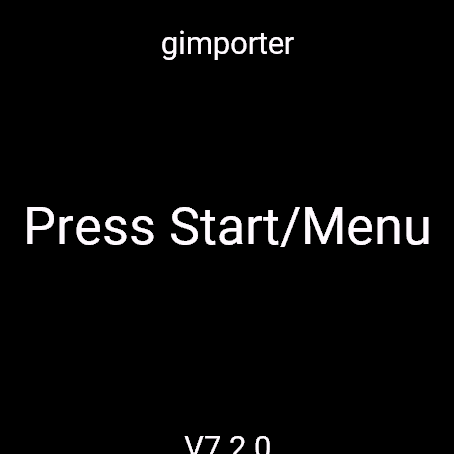
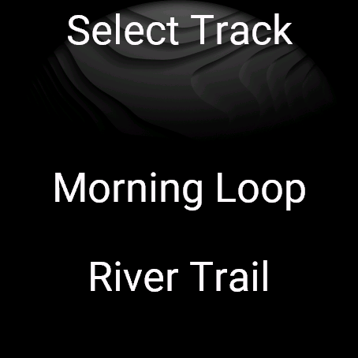
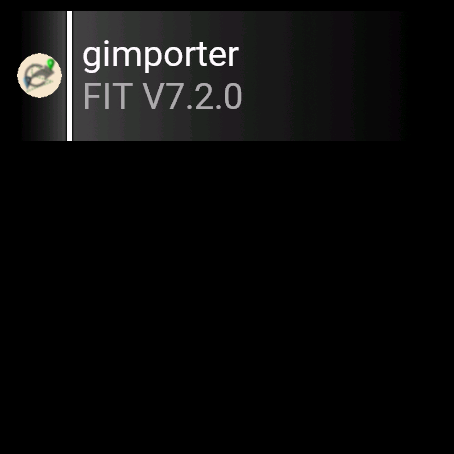

# gimporter — User Guide

gimporter copies GPX and FIT routes from your phone onto your Garmin watch and
imports them as native **courses** you can navigate or start an activity with.
It is the watch half of a pair: the routes are served by the **gexporter**
companion app on your phone, and gimporter downloads them over the Bluetooth
link that Garmin Connect already uses. No account or cable is needed.

---

## Before you start

1. Install the companion app on the **same phone** that runs Garmin Connect:
   - **Android:** gexporter —
     https://play.google.com/store/apps/details?id=org.surfsite.gexporter
   - **iOS (experimental):** https://github.com/clawoo/gexporter-ios
2. Add the GPX/FIT files you want to transfer to the companion app.
3. Make sure the watch is **connected to the phone over Bluetooth** (as it is
   for Garmin Connect).
4. If a download later fails, **turn Wi‑Fi off on the phone** — the transfer
   goes over Bluetooth and Wi‑Fi can get in the way (gimporter warns "Please
   switch off Wifi").

---

## Transferring a route

### 1. Open gimporter and press Start

Open gimporter on the watch (from the widget glance or the app list) and press
**Start** or **Menu**. The version and transfer mode (**FIT** or **GPX**,
depending on your device) are shown for reference.

### 2. Pick a route

gimporter fetches the list of routes from the phone and shows them. Scroll and
select the one you want; long lists page with a **[…]** entry at the bottom for
the next page. Selecting a route downloads it and imports it as a course.

When the transfer finishes you'll see **Download complete**. You can then pick
another route or press **Back** to leave.

### 3. Use the course on the watch

The imported course appears with your other courses — start it from
**Navigation → Courses**, or choose it when you begin an activity.

---

## Glance

On glance-capable watches gimporter shows a glance in the widget carousel with
the app name, the transfer mode (FIT/GPX) and the version. Tap it to open the
app and start a transfer.

---

## Troubleshooting

| Message | What it means / what to do |
|---|---|
| **Waiting for Bluetooth** / **Bluetooth disconnected** | The phone link is down. Enable Bluetooth and keep the phone nearby. |
| **Please switch off Wifi** | Turn Wi‑Fi off on the phone and try again. |
| **Connection failed** | Make sure the gexporter app is running and open on the phone. |
| **No Tracks found** | Add GPX/FIT files in the companion app first. |
| **Request timed out** / **Response too large** | Retry; very large files may not transfer. |
| **Storage full** | Free space on the watch and retry. |
| **Already Downloaded** | That course is already on the watch. |
| **Similar courses found** | The watch already has close matches — choose which course to use. |
| **Device unsupported** | This device cannot import courses this way. |

If something is stuck, press **Back** to cancel the current transfer and
return to the start screen, then press **Start** to try again.

---

## App and widget

gimporter installs as both a full **app** and a **widget**. On Connect IQ 4+
watches the widget runs as a super app with the glance above; on older watches
it appears in the widget carousel. Both open the same transfer screen.
